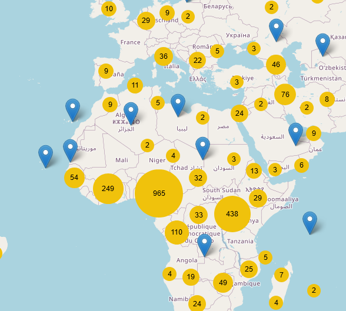

# Leaflet Clustering

High performance clustering for leaflet.



If you want an out-of-the-box experience, go check out [Leaflet.markercluster](https://github.com/Leaflet/Leaflet.markercluster).

If you want more fine-grained control on how clustering is done and mess around with markers, you're at the right place.

## Getting Started

**Clone the repository**:
```bash
git clone https://github.com/stardisblue/leaflet-clusterize.git
cd leaflet-clusterize
```

**Install dependencies**:
```bash
npm install
```

**Run the development server**:
```bash
npm run dev
```

**Build the project**:
```bash
npm run build
```

**Run tests**:
```bash
npm test
```

## Usage

**Import the necessary modules**:
```typescript
import { map, tileLayer, marker } from 'leaflet';
import { ClusterFeatureGroup } from 'leaflet-clusterize';
```

**Initialize the map**:
```typescript
const leafletMap = map('map').setView([48.9, 2.3], 6);
tileLayer('https://{s}.tile.openstreetmap.org/{z}/{x}/{y}.png', {
  attribution: '&copy; <a href="http://osm.org/copyright">OpenStreetMap</a> contributors',
}).addTo(leafletMap);
```

**Create a dummy markers array**:
```typescript
const markers = [
  marker([48.8566, 2.3522]), // Paris
  marker([51.5074, -0.1278]) // London
];

const clusters = new ClusterFeatureGroup(markers, {
  // This option ensures that only markers within the current map view are clustered.
  restrictToVisibleBounds: true,
});
clusters.addTo(leafletMap);
```

**Bind popups or other interactions**:
```typescript
clusters.bindPopup((layer) => `Cluster contains ${layer.getLayers().length} markers`);
```

## API

### ClusterFeatureGroup(_markers_, _options_)

The `ClusterFeatureGroup` is a class that extends Leaflet's `FeatureGroup` to provide clustering functionality for markers. It requires an array of markers and an optional configuration object.

**_markers_**: An array of `CircleMarker` or `Marker` instances that you want to cluster.

**_options_**: An optional object to configure the clustering behavior. It includes:

- **method**: A constructor for the clustering method to be used. Defaults to `FsacClustering`.
- **restrictToVisibleBounds**: A boolean indicating whether clustering should be restricted to markers within the current map view. Defaults to `false`.
- **FsacClustering**: Options specific to the default `FsacClustering` method, which are extracted from the `ClusterFeatureGroup` options. These include:
    - **padding**: A number specifying the padding to be used around clusters. Defaults to `4`.
    - **ShapedCluster**: A constructor for the shaped cluster to be used. Defaults to `CircleCluster`.
    - **shapedClusterOptions**: Options specific to the shaped cluster, excluding `padding`.
    - **ClusterMarker**: A constructor for the cluster marker to be used. Defaults to `CircleClusterMarker`.
    - **clusterMarkerOptions**: Options specific to the cluster marker.

The `ClusterFeatureGroup` provides several methods and properties to interact with the clustering:

- **getLayers()**: Returns the layers created by the clustering method.
- **getClusteringMethod()**: Returns the current clustering method instance.
- **clusterize()**: Triggers the clustering process for the current markers and map state.

## Wishlist

- [ ] allow any cluster marker to use convex hull
- [ ] allow any cluster marker to use spiderfier

### Future

- [ ] animate zoom transitions
- [ ] cache zoom levels
- [ ] allow to add and remove markers